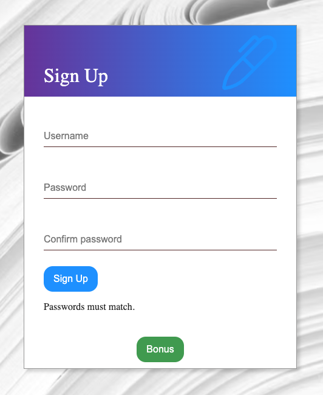
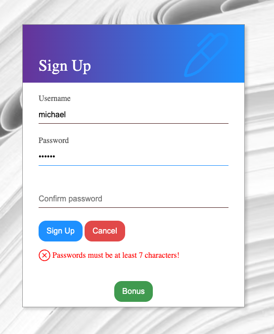
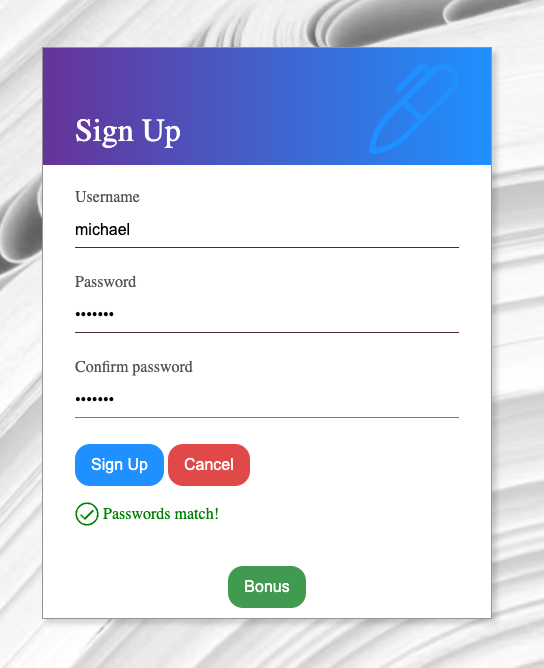

### Date: 6/29/2023

#### By: Michael Lackey

#### [Website](https://michaellackey.com/) | [GitHub](https://github.com/NobodysLackey) | [LinkedIn](https://www.linkedin.com/in/michaelglackey/)
***

### ***Description***

##### An example website to showcase to password validation in React.

##### The app was deployed and can be viewed [here](https://password-validator.surge.sh/).

***

### ***Technologies Used***

***

### ***Getting Started***

##### Sign in with any fake username, but notice that you will receive different results based on your password matching. Toggle the bonus to see a more advanced validator.

***

### ***Screenshots***

  <pre>
    &nbsp;&nbsp;&nbsp;&nbsp;&nbsp;&nbsp;
  </pre>

***

### ***Future Updates***

- [ ] Make the app scale for multiple sized screens
- [ ] Require symbols and special characters

***
